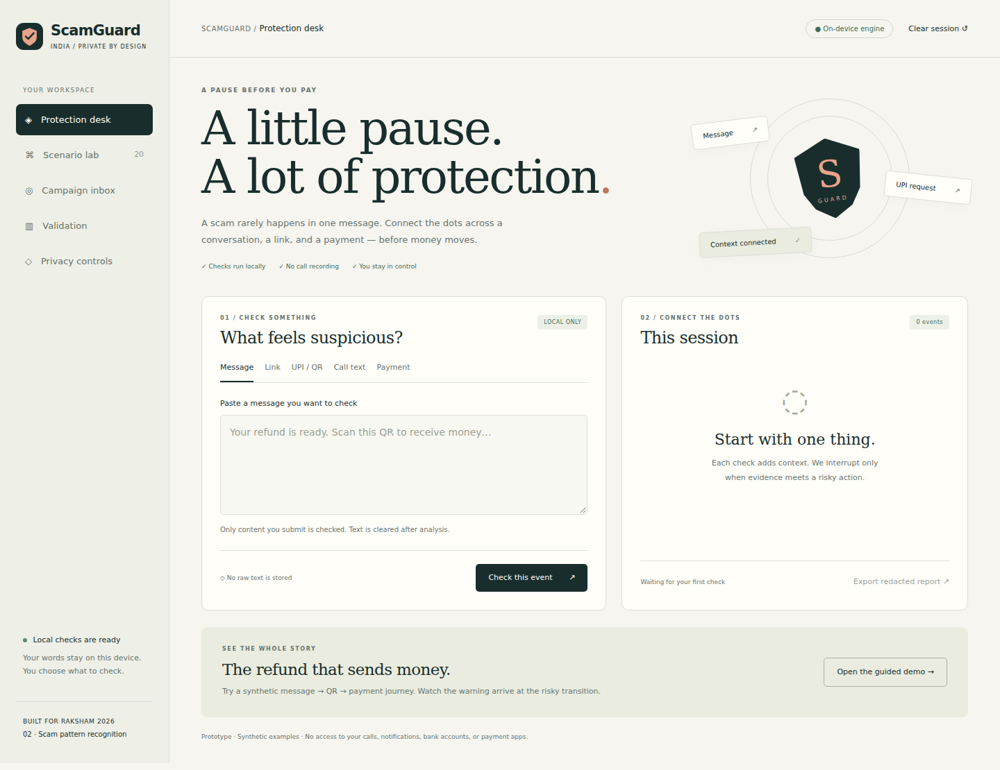

# ScamGuard India

A pause before you pay. Privacy-first recognition of scam workflows across messages, links, consented call text, UPI intents, and simulated payments. Built for RAKSHAM **problem statement 02**.



## Run in one command

Python 3.10+ is enough to serve the application. Node 20+ runs tests and evaluation. No npm packages, API keys, paid services, or model downloads are required at runtime.

```bash
python3 backend/server.py
```

Open **http://127.0.0.1:8000**. Choose **Open the guided demo**, then **Check next event**. The refund message stays passive; the outgoing QR triggers a warning before simulated authorization. Try the restaurant scenario to see an ordinary payment remain uninterrupted.

```bash
npm test
npm run evaluate
```

The mobile-responsive app caches its fixed assets after one successful visit. Local checks work offline; sharing and campaign review require the local server. It never requests a microphone, call log, notification, SMS or banking permission. Browser QR-image decoding is capability-dependent; decoded UPI payload paste always works.

## What is built

- Eleven tactic heads using an exported word/bigram logistic model trained on **157 disclosed AI-authored synthetic texts**; runs locally in JavaScript. Rules and temporal workflow logic guard high-impact decisions. ML corroboration adds at most three score points and cannot warn alone.
- Session expiry, bounded event memory, separate heuristic evidence/action indices, action-aware warning gates, repeat suppression, and re-warning for increased financial stakes.
- Strict outgoing UPI parser; duplicate critical fields, invalid amounts and unsupported currencies are rejected. Payee values and exact amounts are discarded after extraction. The app never follows suspicious URLs.
- Twenty synthetic multi-channel workflows: ten scams, ten ordinary flows, including Hindi/Hinglish, benign negation, and two tactic-composition holdouts.
- Local Python/SQLite fingerprint API with explicit consent, enum-only schemas, deduplication, 24-hour retention, deletion capability, rate limiting, same-origin checks and an analyst token gate.
- Candidate campaign clustering with tactic Jaccard similarity and a count-burst heuristic. Candidates are unverified and never create an automatic blacklist.
- Optional allowlisted PostHog usage events, off by default and independent of pattern-sharing consent. No SDK, autocapture, replay, person profile, free-text property or persistent analytics ID.
- Responsive protection desk, guided scenario lab, campaign inbox, validation view, privacy controls and redacted report export.

## Measured evidence and its limits

`evaluation/results.json` is generated by `npm run evaluate`. The initial suite warned on 10/10 synthetic scam workflows and 0/10 synthetic ordinary workflows. Engine timing is measured in a Linux container, **not a phone**. These curated examples are smoke tests, not a population accuracy estimate. The holdouts reuse known tactics and do not prove generalization. PR-AUC and calibrated risk probabilities are not claimed.

## Optional local configuration

```bash
export SCAMGUARD_REVIEW_TOKEN='choose-a-long-random-secret'
python3 backend/server.py
```

Set the analyst token only on the operator's machine; do not commit it. Review changes candidate status only. No threat policy is published.

For anonymous analytics, configure `POSTHOG_PROJECT_TOKEN` and `POSTHOG_HOST` (`https://us.i.posthog.com` or `https://eu.i.posthog.com`). The user must separately opt in for that visit. Only six named events and coarse enums are sent. Transport failures are best-effort and never delay detection. See [analytics contract](docs/ANALYTICS.md). The project token is intentionally absent from the repository.

## Honest prototype boundary

This is a working **web/PWA reference implementation**, not a completed Android or banking product. Call input is text, payments are simulated, and QR scanning uses an optional browser image decoder. It cannot read ordinary cellular-call audio or other payment apps. Native share intents, consented LiveKit/sherpa ASR, partner payment hooks, HDBSCAN/ADWIN, robust reporter authentication, transaction graphs, real datasets and device measurements remain roadmap work. Never deploy this local server publicly without authentication, TLS, durable consent controls and a security review.

## Project files

| Path | Purpose |
|---|---|
| `core/` | Local extraction, model inference, workflow state and UPI parser |
| `web/` | Responsive application, optional analytics and offline cache |
| `backend/` | Local-only strict fingerprint API and candidate review |
| `ml/` | Reproducible synthetic model training and training data |
| `simulator/` | Disclosed scam and ordinary scenario fixtures |
| `evaluation/` | Reproducible metrics and per-scenario outcomes |
| `tests/` | Engine, privacy, consent, API and browser checks |
| `docs/` | Architecture, safeguards, roadmap, submission PDF and disclosure |

Retrain only when needed: `python3 -m pip install -r requirements-training.txt`, then `python3 ml/train.py`. Runtime inference does not depend on scikit-learn.

Before contest upload: add your actual team members and eligibility details to the submission cover; check the organiser's registration portal and requirements. No registration or submission has been made by this project.

See [validation record](docs/VALIDATION.md), and the [standalone submission PDF](docs/ScamGuard-RAKSHAM-Submission.pdf).
