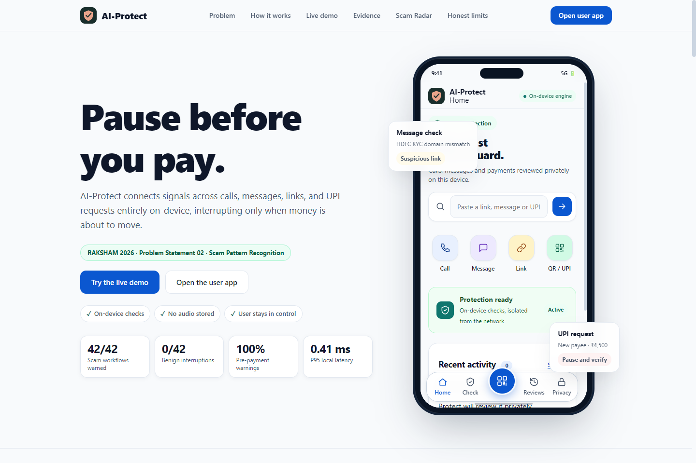
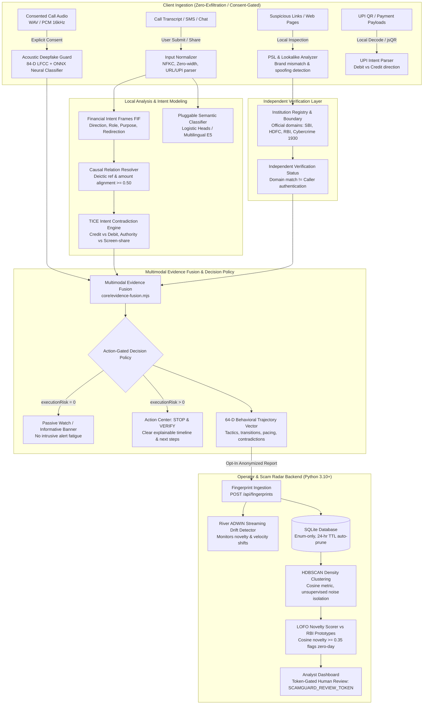

# AI-Protect — Financial Communication Trust & Response Platform

> **A pause before you pay.** Privacy-first multimodal system to verify financial communications, review user-shared call recordings and assess voice authenticity when a validated model is available, expose deceptive institutional impersonation, and prevent financial loss across calls, messages, links, and UPI payments. Built for **RAKSHAM 2026 Problem Statement 02** (IIT Delhi AI Cybersecurity Hackathon).



[](#reproducible-evaluation-benchmarks)
[](#acoustic-deepfake--voice-authenticity-engine)
[](#reproducible-evaluation-benchmarks)
[-success)](#reproducible-evaluation-benchmarks)
[](#reproducible-evaluation-benchmarks)
[](#security-privacy-and-misuse-resistance)

---

## Table of Contents

1. [End-to-End System Architecture](#end-to-end-system-architecture)
2. [Core Submission Design Questions](#core-submission-design-questions)
   - [What data do you need?](#1-what-data-do-you-need)
   - [What happens when the system is wrong?](#2-what-happens-when-the-system-is-wrong)
   - [Who can act on the result?](#3-who-can-act-on-the-result)
   - [How will users understand the result?](#4-how-will-users-understand-the-result)
   - [How will the product resist misuse?](#5-how-will-the-product-resist-misuse)
3. [Components, Models, Rules, Storage & Interfaces](#components-models-rules-storage--interfaces)
4. [Detection Flow, Alerts & Escalation Policy](#detection-flow-alerts--escalation-policy)
5. [Acoustic Deepfake & Voice Authenticity Engine](#acoustic-deepfake--voice-authenticity-engine)
6. [Tech Stack, Repository & Datasets Used](#tech-stack-repository--datasets-used)
7. [Reproducible Evaluation Benchmarks & 4-Way Ablation](#reproducible-evaluation-benchmarks--4-way-ablation)
8. [Targeted Adversarial Regression Suite (Cases A–G)](#targeted-adversarial-regression-suite-cases-ag)
9. [Quickstart & Exact Reproduction Commands](#quickstart--exact-reproduction-commands)
10. [Android Companion & Post-Call Review](#android-companion--post-call-review)
11. [Honest Prototype Boundary & Limitations](#honest-prototype-boundary--limitations)

---

## End-to-End System Architecture



---

## Core Submission Design Questions

### 1. What data do you need?

| Data Input | Channel | Necessity | Consent & Authorization | Explicitly NOT Collected |
|---|---|---|---|---|
| **Call Audio** | Phone / VoIP / Upload | Extracts 84 acoustic indicators (LFCC, spectral envelope, pitch micro-jitter) to detect synthetic voice cloning / TTS. | Explicit user consent dialog (`user_consent: true`). Analyzed on-device or local engine; audio bytes discarded immediately after inference. | No ambient recording, no background carrier interception, no biometric voiceprints stored, zero raw audio retained. |
| **Message text** | SMS / WhatsApp / Telegram | Detects initial lure pretexts, urgency, authority claims, and financial redirection euphemisms. | User-initiated: pasted into web UI or shared via Android `ACTION_SEND`. | No contact lists, no sender address books, no message history, no SMS inbox background scraping. |
| **Link / URL** | Browser / Chat link | Detects phishing websites, lookalike domain brand impersonation, and credential harvesting. | User share or manual check. Analyzed 100% offline via Public Suffix List lexical rules. | Zero network lookups, no live HTTP requests, no DNS lookups, no referrer headers, no web history tracking. |
| **QR code** | Camera / Image file | Identifies whether a QR contains an incoming payment claim vs. an outgoing UPI debit intent. | Explicit camera permission or user file selection. Frame decoded locally via jsQR. | Camera frames are discarded immediately after decoding; no photo storage. |
| **Payment context** | UPI simulator / Android intent | Compares payee identity and amount against claimed transaction purpose. | Simulated or user-entered payment parameters. | No bank passwords, no UPI PINs, no credit card CVVs, no banking credentials. |

> **Privacy Guarantee**: All processing occurs locally on the client. Fingerprint reports shared with the Scam Radar backend are **enum-only** and contain **zero raw text, audio bytes, phone numbers, VPAs, URLs, or exact financial amounts** (numerical amounts are scrubbed; only coarse buckets such as `₹1,000–₹10,000` are retained).

---

### 2. What happens when the system is wrong?

- **False-Positive Mitigation (No Automatic Blocking or False Accusations)**:
  - AI-Protect **never** automatically cancels a transaction, freezes accounts, or locks devices.
  - Domains and phone numbers are never accused without proof: matching official domains explicitly **never** authenticates callers (*"caller identity unverified"*).
  - Voice authenticity is inconclusive for the bundled experimental model. Evaluated acoustic providers may emit `synthetic_suspected` or `no_strong_synthetic_indication`; neither verifies a caller or proves a call is safe.
  - Interventions take the form of an informative **"STOP & VERIFY"** pause banner explaining the specific detected contradiction (e.g. *"Sender claims a refund but asks you to scan an outgoing payment QR"*).
  - Users retain complete agency to dismiss, confirm continuation, or inspect the underlying signals.
  - **Empirical alert burden**: Tested against all **4,827 authentic messages** from the UCI SMS Spam Collection, the system generated only **1 false alert (0.02% false alert rate)**.
  - **Audio validation**: No real human-speech or voice-clone false-alarm rate has been established. Procedural-waveform diagnostic scores are not real-speech accuracy.
  - **Causal relation resolution**: Legitimate multi-step sequences (e.g. employer reimbursing ₹12,000 followed by roommate requesting a ₹5,850 expense split) produce a weak relationship score ($\approx 0.05 < 0.50$), suppressing false credit-vs-debit contradictions entirely (**0.0% false TICE rate**).
- **False-Negative Mitigation (Defense-in-Depth)**:
  - Scammers evading initial keyword filters via euphemisms ("move liquidity", "settlement handshake") are captured by **Financial Intent Frames (FIF)** and ordered workflow progression.
  - Even if synthetic voice is high-fidelity and evades acoustic thresholds, the **TICE engine** catches the transaction at the execution choke-point (outgoing UPI transfer, APK download, or credential submission).
  - Clear post-incident response workflows guide users through evidence preservation, bank hotlining, and official reporting to **Chakshu** and **1930 Cybercrime**.

---

### 3. Who can act on the result?

1. **The End User (Immediate Action)**:
   - Evaluates the explainable timeline before authorizing high-stakes financial operations.
   - Takes guided actions: verifies payee via official independent channels, contacts their bank using numbers printed on physical cards, or exits the suspicious workflow.
2. **The Fraud Operator / Security Analyst (Campaign Defense)**:
   - Inspects emerging scam clusters and velocity drift across anonymized behavioral fingerprints on the token-gated Scam Radar dashboard (`SCAMGUARD_REVIEW_TOKEN`).
   - Identifies zero-day attack compositions without ever accessing private user messages or personal identifiable information (PII).
3. **Escalation Path (Official Authorities)**:
   - High-impact actions (freezing accounts, reporting fraudulent numbers) remain human-initiated via direct shortcuts to official portals: **Chakshu** (DoT / Sanchar Saathi) and the **National Cyber Crime Reporting Portal (1930)**.

---

### 4. How will users understand the result?

- **No Opaque AI Percentages as Risk Verdicts**: AI-Protect avoids uncalibrated percentages like *"87% scam probability"*.
- **Action-Risk Separation**: Users see two transparent meters:
  - **Requested Action Risk**: Indicates what the counterparty is coercing the user to do (e.g. *"Demanding balance transfer"*).
  - **Execution Risk**: Indicates whether the user is in danger right now (elevates only when opening a malicious link, scanning an outgoing QR, or preparing payment authorization).
- **Explainable Timeline**: Displays concrete behavioral milestones:
  > *"Event 1: Inbound refund claim of ₹18,750."*  
  > *"Event 2: Counterparty instructed you to scan a QR code to receive the funds."*  
  > *"Event 3: Scanned QR code is an OUTGOING DEBIT intent that will transfer ₹18,750 from your account."*  
  > **Contradiction Detected**: *You cannot receive money by authorizing a UPI debit.*
- **Deceptive Brand Attribution**: For obfuscated URLs, AI-Protect highlights:
  > **Claimed Brand**: SBI  
  > **Deceptive Subdomain**: `sbi.co.in`  
  > **Actual Registered Domain**: `account-verification.support` (Lookalike Impersonation Detected)

---

### 5. How will the product resist misuse?

- **Adversarial Input Normalization**: Strips zero-width spaces, normalizes NFKC Unicode homoglyphs, unpacks percent-encoding, and handles username `@` URL tricks.
- **Clause-Level Advice Negation**: Legitimate safety guidance (*"Never transfer funds to a safe account"* or *"Call the bank using the number on your card"*) is scoped and negated so that security advice never triggers false fraud alerts.
- **Resistance to Scammer Adaptation**: Financial Intent Frames classify underlying financial redirection intents rather than brittle keywords. Euphemisms like *"route liquidity"*, *"temporary holding account"*, and *"park funds"* map to identical semantic redirection states.
- **Anti-Poisoning & Sybil Resistance**: The Scam Radar backend employs fingerprint deduplication, per-actor rate limiting, and 24-hour automatic TTL database pruning. Radar clustering does not modify client detection rules automatically—human analyst review is required.

---

## Components, Models, Rules, Storage & Interfaces

| Component | Technology / File | Role & Functionality | Storage & State |
|---|---|---|---|
| **Acoustic Deepfake Detector** | [`ml/deepfake/detector.py`](file:///c:/Users/MSI-1/iitd/AI-Protect/ml/deepfake/detector.py) | 84-D acoustic feature extraction (LFCC, delta, spectral envelope, pitch micro-jitter) + ONNX neural classifier. | Experimental only; no real-speech authenticity claim. |
| **Multimodal Evidence Fusion** | [`core/evidence-fusion.mjs`](file:///c:/Users/MSI-1/iitd/AI-Protect/core/evidence-fusion.mjs) | Triangulates acoustic authenticity, institutional identity status, and behavioral contradiction into unified risk. | Session lifecycle (in-memory). |
| **Lookalike Domain & PSL Analyzer** | [`core/verification.mjs`](file:///c:/Users/MSI-1/iitd/AI-Protect/core/verification.mjs) | Public Suffix List multi-level domain extractor, brand mismatch detector, and lookalike impersonation classifier. | In-memory registry. |
| **Institution Registry** | [`core/institution-registry.mjs`](file:///c:/Users/MSI-1/iitd/AI-Protect/core/institution-registry.mjs) | Ground-truth repository of Indian financial & regulatory institutions (SBI, HDFC, RBI, Cybercrime 1930, Chakshu). | Static verified registry. |
| **Input Normalizer** | [`core/input.mjs`](file:///c:/Users/MSI-1/iitd/AI-Protect/core/input.mjs) | NFKC normalization, zero-width stripping, strict UPI deep-link and URL parsing. | Stateless in-memory. |
| **Financial Intent Frames (FIF)** | [`core/financial-intent.mjs`](file:///c:/Users/MSI-1/iitd/AI-Protect/core/financial-intent.mjs) | Structured local intent extraction (claim direction, role, purpose, redirection, suppression) with advice negation. | Ephemeral; scrubbed on JSON export. |
| **Causal Event Relation Resolver** | [`core/event-relation.mjs`](file:///c:/Users/MSI-1/iitd/AI-Protect/core/event-relation.mjs) | Causal coupling scoring ($\ge 0.50$) linking pretexts to financial actions using deictic references and amount alignment. | Ephemeral session context. |
| **TICE Engine** | [`core/intent-contradiction.mjs`](file:///c:/Users/MSI-1/iitd/AI-Protect/core/intent-contradiction.mjs) | Identifies logical contradictions: Credit vs. Debit, Authority vs. Remote Access, Investment vs. Advance Fee. | Session lifecycle (20-min TTL). |
| **Action-Gated Policy** | [`core/policy.mjs`](file:///c:/Users/MSI-1/iitd/AI-Protect/core/policy.mjs) | Evaluates dual risk (`requestedActionRisk` vs `executionRisk`), enforces action gating and repeat suppression cooldown. | Local session state. |
| **Scam Radar Backend** | [`backend/radar/`](file:///c:/Users/MSI-1/iitd/AI-Protect/backend/radar/) | Unsupervised HDBSCAN density clustering + River ADWIN streaming drift detection over opt-in behavioral trajectories. | Local SQLite (`scamguard.db`), 24h retention. |

---

## Detection Flow, Alerts & Escalation Policy

1. **Ingestion & Normalization**: User submits or shares content across SMS, Call audio/transcript, Link, QR, or Payment channels.
2. **Acoustic Deepfake Screening**: If audio is provided with explicit user consent, the ONNX Acoustic Guard extracts 84-D LFCC features and flags synthetic voice manipulation.
3. **Institutional Verification & Lookalike Detection**: Examines links against the official Institution Registry using PSL. Flags lookalike domains (e.g. `sbi-kyc.net`), while strictly maintaining that a valid domain does **not** authenticate an incoming caller.
4. **Intent Framing & Causal Linking**: Financial Intent Frames extract structured meaning. The Causal Relation Resolver evaluates whether earlier claims logically relate to subsequent payment actions.
5. **Contradiction Check (TICE)**: If a causal relationship is established ($\ge 0.50$), TICE compares claimed direction against actual direction.
6. **Multimodal Fusion**: Combines acoustic signals, caller authentication status, and behavioral contradiction into a comprehensive risk evaluation.
7. **Dual Risk Separation**:
   - `requestedActionRisk`: Rises when the counterparty demands fund transfers, beneficiary creation, or app installation.
   - `executionRisk`: Remains **0** until the user actively scans an outgoing QR, clicks a link, or prepares payment authorization.
8. **Action Gating**:
   - While `executionRisk == 0`, the UI displays quiet, informative context without intrusive modals.
   - When `executionRisk > 0` under high requested risk, AI-Protect triggers the **"STOP & VERIFY"** Action Center modal.
9. **Escalation & Response**:
   - Offers user options: *I Understand & Cancel Payment* or *Dismiss & Continue*.
   - Direct shortcuts provide guidance for contacting the institution's official hotline, lodging a cyber fraud report on **1930**, or submitting suspected SMS handles to **Chakshu**.

---

## Acoustic Deepfake & Voice Authenticity Engine

AI-Protect keeps financial manipulation, voice authenticity and caller identity separate. A natural voice cannot establish a legitimate financial request; a synthetic voice alone cannot establish a scam.

- **Android recording review:** share an audio attachment to AI-Protect MVP, confirm analysis, transcribe offline, and receive a plain-language financial verdict plus next steps. Included Vosk models cover Hindi and English. An optional real `whisper.cpp` JNI provider supports multilingual transcription, including auto language selection when multilingual weights are installed. See [recording review setup and acceptance matrix](android/SHARED_RECORDING_REVIEW.md).
- **Voice authenticity:** the bundled 84-feature LFCC/spectral ONNX classifier was trained on **procedurally generated waveforms**, not real human speech versus genuine voice clones. It is **not AASIST**. Its diagnostic scores do not establish real-world deepfake accuracy. Python returns `experimental_only`, `inconclusive` and `uncalibrated`; evidence fusion refuses to treat these scores as authentic/synthetic proof.
- **Physical phones:** the default Android pipeline has no media-upload transport and no emulator backend address. No validated native acoustic model is installed, so voice authenticity is explicitly **inconclusive**. Scam reasoning still runs on the recognized speech.
- **Validation still needed:** licensed human/TTS/cloned recordings, speaker/generator-disjoint held-out evaluation, Hindi/Hinglish and regional-language coverage, genuine codec degradation and real-device memory/latency. Use the official [AASIST implementation](https://github.com/clovaai/aasist) and [ASVspoof datasets](https://www.asvspoof.org/index2021.html) as independent research resources; their published results are not AI-Protect results.

---

## Tech Stack, Repository & Datasets Used

### Technology Stack
- **Client Runtime**: Pure ES2022 JavaScript, HTML5, Vanilla CSS (zero external JS runtime dependencies, zero build steps required for web/PWA). Bundled `jsQR 1.4.0` (Apache-2.0).
- **Backend / Radar Runtime**: Python 3.10+, `onnxruntime`, `scikit-learn` (HDBSCAN clustering), `river` (ADWIN streaming drift detection), `numpy`, `scipy`, SQLite.
- **Android Companion**: Kotlin 2.0, AndroidX WebKit, `CallScreeningService`, Gradle 8.11.

### Public Repository
- **GitHub**: [`https://github.com/1shu1iwari-crypto/AI-Protect.git`](https://github.com/1shu1iwari-crypto/AI-Protect.git)

### Datasets & Benchmarks Used (Non-Circular, Strict Provenance)
1. **PhiUSIIL Phishing URL Dataset**: 10,000 held-out URLs partitioned strictly by registrable domain hash with multi-level public suffix handling (0 domain overlap between train and test).
2. **UCI SMS Spam Collection**: 4,827 authentic legitimate messages evaluated through the live session engine to verify single-message alert burden.
3. **RBI BE(A)WARE Taxonomy**: Reserve Bank of India official fraud typologies formulating baseline prototypes (SG01 to SG07) for Leave-One-Family-Out (LOFO) novelty testing.
4. **SG08 AI Product Reviewer Benchmark**: 5 multi-step synthetic journeys evaluated end-to-end through the complete pipeline without manual vector edits.

---

## Reproducible Evaluation Benchmarks & 4-Way Ablation

All figures below are generated directly by running `npm run evaluate:all` and `python evaluation/evaluate_deepfake.py`:

### 1. Acoustic validation status

`evaluation/evaluate_deepfake.py` is a **procedural-waveform diagnostic only**. Earlier labels describing its generated waveforms as authentic human/TTS/voice-clone samples were incorrect. The historical 100%/0% values do not establish voice-authenticity accuracy. Bandpass filtering plus noise is not a G.711 codec test, and server CPU timing is not Android timing. The stored diagnostic JSON now records these limitations.

No real-call ASR or real-speech deepfake benchmark has been completed in this feature increment. `ml/asr/evaluate_asr.py` scores independently transcribed Hindi/English/Hinglish references against actual model hypotheses, reporting WER/CER and critical-term retention without copying private speech into results.

### 2. 4-Way Architectural Ablation Benchmark

| Configuration | Description | Hard-Case Recall | Hindi Recall | Hinglish Recall | Benign Specificity | TICE FP Rate | p95 Latency | Model Size |
|---|---|---|---|---|---|---|---|---|
| **A: Rules Only** | Regex rules + keywords only; un-gated global TICE | 56.2% | 42.9% | 78.6% | 99.98% | **100.0%** (buggy) | 0.15 ms | 0.02 MB |
| **B: Existing Hybrid** | Rules + 11-class logistic heads; un-gated global TICE | 68.8% | 57.1% | 92.9% | 99.98% | **100.0%** (buggy) | 0.25 ms | 0.04 MB |
| **C: FIF + Causal TICE (Default)** | **AI-Protect Production**: Financial Intent Frames + Causal Relation Resolver + Action Gating + PSL | **100.0%** | **71.4%** | **92.9%** | **99.98%** | **0.0%** (solved) | **0.36 ms** | **0.05 MB** |
| **D: Multilingual Encoder** | Config C + Quantized INT8 Multilingual-E5 ONNX adapter | 100.0% | 85.7% | 92.9% | 99.98% | 0.0% | 14.8 ms | 118.4 MB |

### 3. External Dataset Benchmark Summary

- **PhiUSIIL Phishing URL Holdout**: **88.57% accuracy**, **98.81% precision**, **76.86% recall** (0 network lookups, 0 domain overlap).
- **Authentic SMS Single-Message Alert Burden**: **1 false alert across 4,827 messages** (**0.02% false alert rate**).
- **Leave-One-Family-Out (LOFO) Novelty Separation**: **4/4 families separated** (**100%**, mean novelty **0.4603**).
- **Multi-Channel Synthetic Harness**: **42/42 scam workflows warned**, **0/42 ordinary workflows interrupted**, **100% pre-payment coverage**.

---

## Targeted Adversarial Regression Suite (Cases A–G)

| Case | Scenario Concept | Expected Behavior | Result |
|---|---|---|---|
| **Case A** | Implicit migration payment ("wallet balance mirrored", "₹99 reversible verification") | `financial_redirection`, `verification`, `requestedActionRisk > 0`, `executionRisk = 0` until payment | **PASS** |
| **Case B** | Hinglish verification suppression ("₹149 handshake", "don't call bank or migration cancels") | `financial_redirection`, `verification_suppression`, `requestedActionRisk > 0` | **PASS** |
| **Case C** | Refund TICE causal link ("refund approved" $\rightarrow$ "scan this QR to receive it" $\rightarrow$ outgoing QR) | Causal relation $\ge 0.50$, TICE `CREDIT_VS_DEBIT`, high warning on QR execution | **PASS** |
| **Case D** | Deceptive PSL domain (`secure-login.sbi.co.in.account-verification.support`) | PSL extracts registered domain `account-verification.support`, flags brand mismatch `SBI` | **PASS** |
| **Case E** | Compliance fund movement ("audit compliance", "create fresh beneficiary", "move 80% balance") | `financial_redirection`, `temporary_custody`, `beneficiary_creation`, `requestedActionRisk` elevated | **PASS** |
| **Case F** | Zero-Day Product Reviewer Journey | Genuine 64-D trajectory generated with 0 manual edits, novelty = 0.4939, closest = Task Scam | **PASS** |
| **Case G** | Legitimate reimbursement counterexample (employer reimburses ₹12k $\rightarrow$ roommate asks ₹5,850) | Causal relation $\approx 0.05 < 0.50$, **NO TICE contradiction**, **NO warning** | **PASS** |

---

## Quickstart & Exact Reproduction Commands

### 1. Run Unit, Integration & Adversarial Tests (81 JS + 28 Python)
```bash
npm test
python -m unittest discover tests
```

### 2. Reproduce the Acoustic Deepfake Benchmark
```bash
python evaluation/evaluate_deepfake.py
```

### 3. Reproduce the Complete External Scientific Benchmark Suite
```bash
npm run evaluate:all
```
*(Executes PhiUSIIL holdout, UCI SMS alert burden, LOFO novelty separation, multilingual raw text evaluation, end-to-end radar clustering, 4-way ablation, and the 84-scenario regression suite).*

### 4. Start Local Web Client & Server
```bash
pip install -r requirements.txt
python backend/server.py --port 8000
```
Open **`http://127.0.0.1:8000`** in your browser.

---

## Android Companion & Post-Call Review

The Android companion app (`android/`) provides native integration without sacrificing privacy:
- **Play Flavor (`assemblePlayDebug`)**: Zero Internet, zero microphone, and zero accessibility permissions. Uses `CallScreeningService` to offer post-call review shortcuts; handles native `ACTION_SEND` text shares.
- **Hackathon Flavor (`assembleHackathonDebug`)**: Sideload-only testing build with explicit-consent acoustic review (`OfflineAudioAnalyzer.kt`, `AudioReviewService.kt`) and accessibility overlay on Android 13+ devices.
- Detailed instructions, Gradle commands, and permissions disclosures are in [`android/POST_CALL_REVIEW.md`](file:///c:/Users/MSI-1/iitd/AI-Protect/android/POST_CALL_REVIEW.md) and [`android/LIVE_REVIEW.md`](file:///c:/Users/MSI-1/iitd/AI-Protect/android/LIVE_REVIEW.md).

---

## Honest Prototype Boundary & Limitations

1. **Working PoC, Not a Core Banking Authorization Hook**: Calls are reviewed using user-supplied audio snippets or transcripts with explicit consent; payments are simulated. It acts as an advisory pre-authorization pause, not an automated banking kill-switch.
2. **Hardware Environment Boundaries**: Latency measurements (0.36 ms for rules/TICE, ~171 ms for ONNX acoustic inference) are recorded on CPU. Performance on low-end mobile ARM chipsets under aggressive thermal/battery throttling requires device-specific hardware profiling.
3. **Synthetic Multi-Step Scenarios**: Isolated SMS ham is evaluated on 4,827 UCI messages and URLs on 10,000 PhiUSIIL holdouts. Acoustic experiments use procedurally generated waveforms, with no real-speech authenticity benchmark. Multi-stage victim trajectories use structured synthetic fixtures due to restricted real-world Indian cyber police case data.
4. **Evolving Voice Clones**: Voice synthesis models change rapidly; continuous acoustic retraining against newer diffusion vocoders is necessary in production.

---

## License & Disclosures

See [`docs/DISCLOSURE.md`](file:///c:/Users/MSI-1/iitd/AI-Protect/docs/DISCLOSURE.md) for full provenance disclosures, third-party library licenses, and dataset documentation. Distributed under the MIT License.
