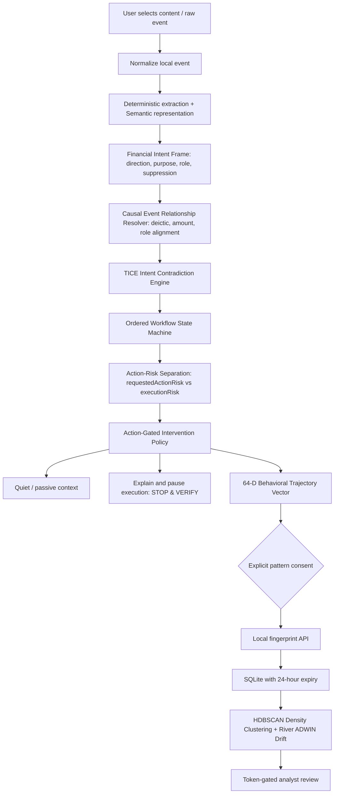

# ScamGuard architecture and trust boundaries

## Implemented system

All arrows above are implemented. Browser content stays local. No raw text is sent to a server; no text, URLs, VPAs or exact amounts are retained in the derived session. Before analysis, user input remains in the field; a PWA share handoff temporarily holds raw text in worker memory for up to 60 seconds, then deletes it. No share text is placed in URLs, disk storage or CacheStorage. QR frames/images decode on the device and camera tracks stop on scan success, close, channel/view change, or backgrounding. Events retain derived action/identity/persuasion/verification enums, tactic evidence, channel, timestamp and coarse payment metadata. Sessions keep only allowlisted numeric scores; snapshots discard legacy model scores.

## Detection logic & Layered Reasoning

1. **Normalization & Negation Guarding**: NFKC, case and invisible-control normalization; sentence and clause-aware negation suppression for credential, remote-control, and fund redirection advice (e.g. "Never transfer funds to a safe account" stays quiet).
2. **Financial Intent Frames (FIF)**: Local structured representation (`core/financial-intent.mjs`) extracting `claim_direction`, `requested_action`, `purpose`, `counterparty_role`, `temporary_custody`, `verification_suppression`, `financial_redirection` euphemisms ("move liquidity", "settlement handshake", "temporary holding account"), and coarse amount relations. Non-enumerable `raw_amount` is used for in-memory causal matching and scrubbed on JSON serialization.
3. **Causal Event Relationship Resolver**: Evaluates claim-to-action coupling (`core/event-relation.mjs`) using deictic references ("this QR", "to receive it"), amount match vs divergence penalty (-0.35), counterparty role alignment, and purpose compatibility. Contradictions require a calibrated relationship score $\ge 0.50$, preventing false credit-vs-debit contradictions on multi-party benign workflows (e.g. employer reimbursement followed by roommate expense split).
4. **Action-Risk Semantics & Action Gating**: Strict separation of `requestedActionRisk` (what the counterparty asks: transfer, scan QR, add beneficiary, install app) from `executionRisk` (user actively executing an action: preparing payment, scanning outgoing QR, entering OTP). A message demanding ₹20,000 raises `requestedActionRisk > 0` with `executionRisk = 0`. Intrusive warnings ("Stop & verify") trigger only when execution occurs.
5. **PSL-Backed Domain Parser & Brand Spoofing Defense**: Extracts true registrable domains using the Public Suffix List (`core/domain-parser.mjs`) handling multi-part suffixes (`.co.in`, `.co.uk`, etc.). Detects brand mismatches (e.g. `secure-login.sbi.co.in.account-verification.support` identifies brand `SBI`, deceptive text `sbi.co.in`, and true domain `account-verification.support`) alongside adversarial evasion indicators (subdomain padding, percent encoding, homoglyphs, username tricks).
6. **Ordered Workflow State Machine**: Explicit ordered states cover refund/outgoing QR, authority/pressure/transfer, investment/payment/escalation, task/deposit/withdrawal, KYC/pressure/sensitive request, support/remote access/financial action, and financial redirection. QR is treated as an outgoing intent, not a completed payment.
7. **Repeat Suppression & Cooldown**: Sixty-second repeat suppression; a different matched workflow, severity increase, newly requested sensitive action, or two-bucket financial increase can re-warn. Suppression does not lower the assessed risk.

## Shared Modules & Architecture

- `core/financial-intent.mjs`: Structured Financial Intent Frames with advice negation and privacy protection.
- `core/event-relation.mjs`: Causal relationship scoring linking pretexts to actions.
- `core/domain-parser.mjs`: Public Suffix List domain extractor and deceptive brand analyzer.
- `core/semantic-provider.mjs`: Pluggable semantic interface supporting lightweight concept heads (`ConceptSemanticProvider`) and quantized Multilingual-E5 ONNX embeddings (`MultilingualEncoderSemanticProvider`).
- `core/intent-contradiction.mjs`: TICE engine enforcing causal relationship verification before raising contradiction flags.
- `core/policy.mjs`: Dual-risk intervention policy (`requestedActionRisk` + `executionRisk`).
- `core/workflow.mjs`: Ordered temporal workflow state machine.
- `core/url-classifier.mjs`: Zero-network PhiUSIIL model inference augmented with PSL brand spoofing cues.
- `core/trajectory.mjs`: 64-dimensional behavioral trajectory vector builder.

`package.json` is the release version authority. Test/evaluation commands generate `core/version.mjs`; backend configuration and Android build/version assets read the same package version directly. The versioned institution data and registry interface live in `institution-registry.mjs`, so domains/institutions can be extended without changing workflow code. A domain match never authenticates a caller or reduces behavioral risk.

Android uses exact-origin, main-frame `WebViewCompat` messages and asynchronous request/reply handling. Older WebViews without messaging support retain manual checks and require an update for native storage/sharing. Native storage reconstructs snapshots from bounded derived fields; persisted prose and unknown fields are dropped, and shared JavaScript regenerates explanations on restore. No new permission or Kotlin detector is introduced. Local classifiers/modules are packaged in the APK and offline PWA asset cache.

## Fingerprints, Scam Radar and HDBSCAN Trajectory Clustering

- **Privacy-Safe Fingerprint Schema**: Version, random session ID, enum tactic set, ordered tactic sequence, enum channel set, coarse amount bucket, event count, and a 64-dimensional behavioral trajectory vector (`core/trajectory.mjs`). No personal data, phone numbers, raw text, audio, or bank details are retained or uploaded. Fingerprints remain strictly opt-in with mandatory 24-hour retention expiry.
- **64-Dimensional Behavioral Trajectory Representation**:
  - Dims 0–12: Relative frequency of extracted behavioral tactics.
  - Dims 13–20: Persuasion and coercion intensity (urgency, authority, secrecy, isolation).
  - Dims 21–25: Channel utilization distribution (call, message, link, QR, payment).
  - Dims 26–37: Inter-channel transitions (e.g. call → link, message → QR).
  - Dims 38–41: Payment pacing and velocity.
  - Dims 42–45: TICE intent contradictions (credit vs. debit, authority vs. remote access, investment vs. advance fee, KYC vs. sideload).
  - Dims 46–49: Temporal duration and session pacing.
  - Dims 50–55: Sensitive action indicators (credentials requested, OTP solicited, remote tool pushed).
  - Dims 56–63: Risk progression dynamics and alert severity delta.
  *Note: This is an inspectable, hand-engineered behavioral feature vector, not an unexplainable learned neural embedding.*
- **Unsupervised HDBSCAN Clustering (`backend/radar/cluster.py`)**:
  - Clusters reported trajectories in cosine distance space (`metric='precomputed'`).
  - Automatically identifies distinct clusters and isolates noise without requiring a fixed cluster count $k$.
  - Compares cluster centroids against behavioral fraud-family prototypes derived from the RBI BE(A)WARE taxonomy (SG01 to SG07).
  - Flags novel attack workflow compositions when cosine novelty $\ge 0.35$.
- **Streaming Emergence Detection via River ADWIN (`backend/radar/drift.py`)**:
  - Monitors report ingestion stream dynamically inside `POST /api/fingerprints`.
  - Employs River's ADWIN (Adaptive Windowing) to detect distribution shifts in streaming novelty and report velocity.
  - Generates actionable emergence cues without polling or false triggers on dashboard refreshes.
- **Sybil Resistance and Operator Boundaries**:
  - Reporter identities remain unverified in the local PoC; deduplication and rate limits provide bounded local protection. Production deployment requires authenticated client attestation.
  - Radar candidates never alter local client warnings automatically; human analyst review remains mandatory before publishing countermeasures.

## Security and privacy mitigations

- Localhost binding by default. No public deployment claimed; production requires authenticated reporters, per-actor quotas, TLS, encrypted durable storage, access/audit controls, abuse resistance and a signed, versioned policy pipeline.
- Static route allowlist, resolved-path containment, no directory listings or backend file downloads. JSON-only bounded requests, rate limits, schema allowlists, same-origin rejection, CSP, permissions policy and no content logs.
- Opaque random ID grants deletion of the corresponding report; it must remain private. Retention is enforced on ingestion and reads. SQLite physical page erasure and forensic browser-memory erasure are not guaranteed.
- Pattern sharing and anonymous usage analytics have separate visit-only opt-ins. Analytics has fixed events, enum properties, no profiles, geolocation enrichment disabled, no replay, no exact latency, and secure random in-memory IDs. Fixed source enums distinguish synthetic labelled checks from unlabelled user checks. Operator token stays server-side.
- Offline cache contains only fixed public app assets, fixtures, model and evaluation; API results and user content are excluded.

## Deployment pathway

Phase 1 is this web reference MVP. Phase 2 adds a native Android Sharesheet/QR adapter and consented controlled VoIP audio with sherpa streaming ASR. Android CallScreeningService provides call details and screening decisions, not unrestricted ordinary call audio. No accessibility scraping or direct SIM audio capture is implemented. The separate Android hackathon flavor now contains an opt-in accessibility overlay and acoustic microphone pipeline; see `android/LIVE_REVIEW.md`. This is not a Play-distribution design. Phase 3 integrates a pre-authorization partner SDK with a bank/PSP/wallet in an authorised sandbox. Phase 4 adds authenticated campaign reporters, validated clustering/drift, analyst-approved signed snapshots and model updates. Financial network analysis requires authorised or synthetic network data and is not needed for the phone hot path.

## v0.3 additive review / Android flow

`ReviewSession extends Session` reuses the original warning policy and fingerprint schema. Each explicit Check adds a bounded derived timeline entry: channel, timestamp, verification category, tactic enums, stage, severity and fixed explanation. Raw sender contacts, domains, messages, VPA and exact amounts are discarded. Direction and user flag are metadata, never sufficient risk evidence. Verification runs lexically before assessment; a registry match does not suppress behavioral risk. Registry scope is intentionally two institutions, HDFC and ICICI; other claims remain unknown.

Android Telecom → allow incoming call immediately → private notification → user tap → quick signals → explicit review check → existing engine. Native ACTION_SEND stages content in memory; a separate Check associates it with the chosen review. Kotlin does not duplicate the detector. WebViewAssetLoader serves packaged assets over a local synthetic HTTPS origin; arbitrary requests/navigation are denied and INTERNET is absent. Only fixed official reporting routes can be opened by a bridge call following a user click. Backup-excluded snapshots contain derived fields, are capped at 10, and expire on read after 24 hours. No screenshot or call identifier is stored by the native callback.

Web reviews are in memory. A service-worker memory slot preserves the current redacted review for a POST share handoff (up to 20 minutes); it is never put into Cache Storage. Android persists only redacted snapshots. Consent is never restored. Paid/not-paid response state and actions are local; the only optional server report remains the existing fingerprint. Analyst cards add per-tactic report frequency alongside existing ordered sequence, report count, shift cue and manual review status.

Official response sources checked 2026-10-03: https://www.sancharsaathi.gov.in/ (Chakshu for suspected communications); https://cybercrime.gov.in/ and 1930 for financial cybercrime. Institution registry sources: https://www.hdfc.bank.in/ and https://www.icici.bank.in/. Routes and the deliberately small registry require periodic human maintenance.
