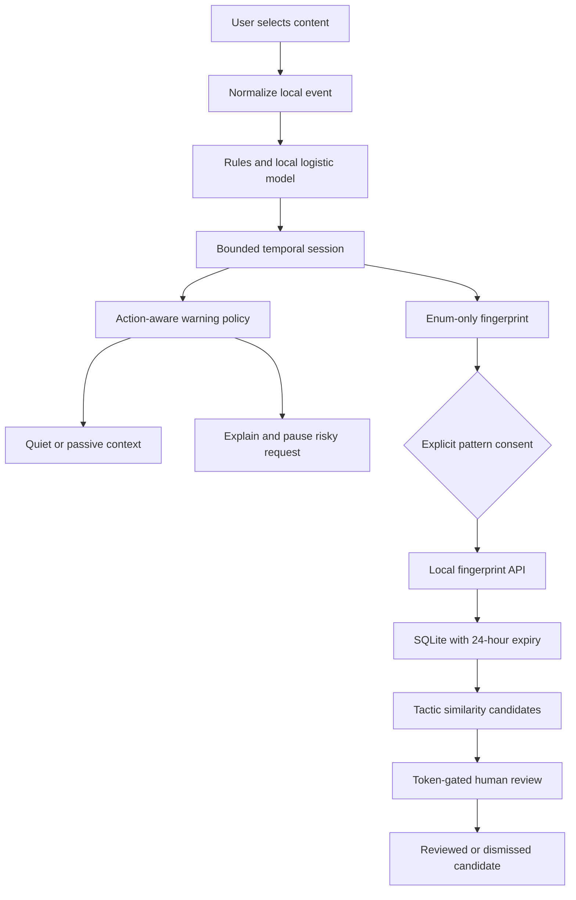

# ScamGuard architecture and trust boundaries

## Implemented system

All arrows above are implemented. Browser content stays local. No raw text is sent to a server; no text, URLs, VPAs or exact amounts are retained in the session. Events retain tactics, local model scores, channel, timestamp, and coarse payment bucket. Model inference uses presence word/bigram features and exported logistic coefficients; no network inference exists. The classifier is synthetic-trained and uncalibrated. Its corroboration contributes up to three points only after a deterministic workflow matches.

## Detection logic

1. NFKC, case and invisible-control normalization; sentence-aware negation suppression for credential and remote-control advice.
2. Extract eleven behavior tactics and optional local model corroboration. URLs are inspected as text and never fetched. This is not URL reputation or APK malware analysis.
3. One explicit local session, at most 64 events; reset after a 20-minute gap. Timestamp order is enforced. User-selected sessions avoid hidden cross-app association. Different conversations need a manual reset; automated session association is not implemented.
4. Ordered pretext-to-payment matching for refund, authority and investment workflows; additional task-fee, remote-access, credential and pressure patterns. A QR is an outgoing intent, not a completed payment.
5. Evidence and action indices are heuristic 0-99 scores. Quiet when no immediate risky action; warn only at a supported action with sufficient independent signal families or a direct secret-credential request.
6. Sixty-second repeat suppression; severity increases, a newly requested sensitive action, or a two-bucket financial increase can re-warn. Suppression does not lower the assessed risk. Passive evidence stays visible.
7. Warning offers cancellation and an explicit continuation confirmation. Both act only on the simulator. Users remain in control; real verification requires an independent official channel.

## Data flow and review

Fingerprint schema: version, random session ID, enum tactic set, ordered tactic sequence, enum channel set, amount bucket and event count. Reject all unexpected fields. No hashing of low-entropy personal identifiers is necessary because no personal identifiers are uploaded. Fingerprints remain potentially sensitive; consent and 24-hour expiry are mandatory.

Jaccard similarity >=0.70 groups tactic sets. At least three distinct session IDs are required for a candidate. A five-minute count threshold labels a possible burst. This is a simple prototype heuristic, not ADWIN, statistical concept drift, identity verification or HDBSCAN. A malicious party can create multiple IDs; deduplication is not Sybil resistance. Candidates never change local warnings automatically. Analyst review is authenticated with an operator token; review changes status only, does not publish policies or label a bank account as fraudulent.

## Security and privacy mitigations

- Localhost binding by default. No public deployment claimed; production requires authenticated reporters, per-actor quotas, TLS, encrypted durable storage, access/audit controls, abuse resistance and a signed, versioned policy pipeline.
- Static route allowlist, resolved-path containment, no directory listings or backend file downloads. JSON-only bounded requests, rate limits, schema allowlists, same-origin rejection, CSP, permissions policy and no content logs.
- Opaque random ID grants deletion of the corresponding report; it must remain private. Retention is enforced on ingestion and reads. SQLite physical page erasure and forensic browser-memory erasure are not guaranteed.
- Pattern sharing and anonymous usage analytics have separate visit-only opt-ins. Analytics has fixed events, enum properties, no profiles, geolocation enrichment disabled, no replay, no exact latency, and random in-memory IDs. Operator token stays server-side.
- Offline cache contains only fixed public app assets, fixtures, model and evaluation; API results and user content are excluded.

## Deployment pathway

Phase 1 is this web reference MVP. Phase 2 adds a native Android Sharesheet/QR adapter and consented controlled VoIP audio with sherpa streaming ASR. Android CallScreeningService provides call details and screening decisions, not unrestricted ordinary call audio. No accessibility scraping or SIM recording workaround is planned. Phase 3 integrates a pre-authorization partner SDK with a bank/PSP/wallet in an authorised sandbox. Phase 4 adds authenticated campaign reporters, validated clustering/drift, analyst-approved signed snapshots and model updates. Financial network analysis requires authorised or synthetic network data and is not needed for the phone hot path.
