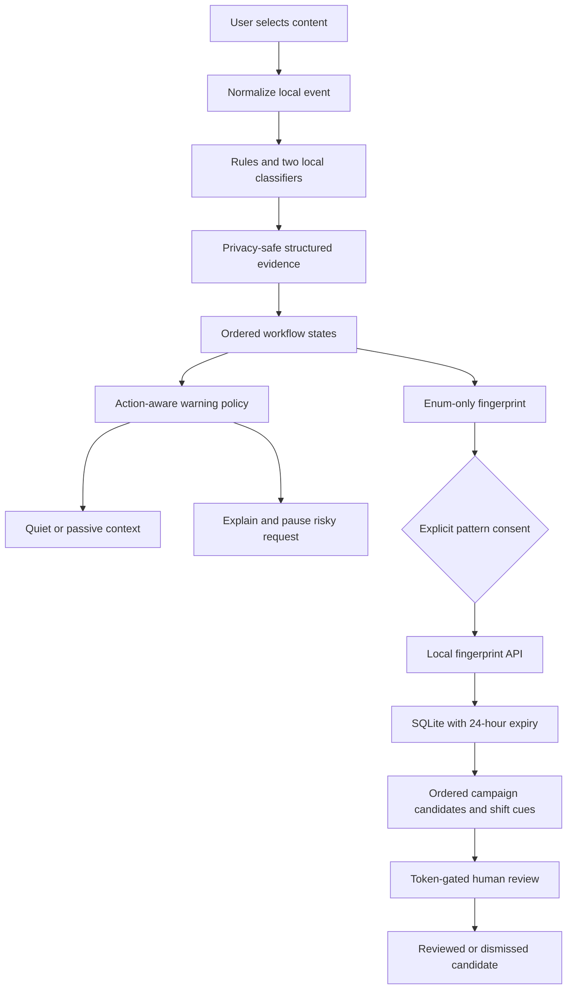

# ScamGuard architecture and trust boundaries

## Implemented system

All arrows above are implemented. Browser content stays local. No raw text is sent to a server; no text, URLs, VPAs or exact amounts are retained in the derived session. Before analysis, user input remains in the field; a PWA share handoff temporarily holds raw text in worker memory for up to 60 seconds, then deletes it. No share text is placed in URLs, disk storage or CacheStorage. QR frames/images decode on the device and camera tracks stop on scan success, close, channel/view change, or backgrounding. Events retain derived action/identity/persuasion/verification enums, tactic evidence, channel, timestamp and coarse payment metadata. Sessions keep only allowlisted numeric scores; snapshots discard legacy model scores. The frozen word/bigram classifier supplies optional corroboration. The additional concept-feature classifier can add semantic evidence to ordered workflows. Both are synthetic-trained and uncalibrated; no network inference exists.

## Detection logic

1. NFKC, case and invisible-control normalization; sentence-aware negation suppression for credential and remote-control advice.
2. Extract thirteen behavior tactics with deterministic protections and optional semantic evidence. URLs are normalized and inspected as text, never fetched. This is not URL reputation or APK malware analysis. The synchronous classifier adapter accepts `{scores:{tactic:0..1}}`; passing `semanticClassifier:null` disables it for the deterministic-only ablation. Adapter failures preserve deterministic checks; unknown model fields are discarded.
3. One explicit local session, at most 64 events; reset after a 20-minute gap. Timestamp order is enforced. User-selected sessions avoid hidden cross-app association. Different conversations need a manual reset; automated session association is not implemented.
4. Explicit ordered states cover refund/outgoing QR, authority/pressure/transfer, investment/payment/escalation, task/deposit/withdrawal, KYC/pressure/sensitive request, support/remote access/financial action and coercive trust/reward requests. The most recent ordered completion wins, with stable family precedence for ties. A QR is an outgoing intent, not a completed payment.
5. Evidence strength counts distinct derived signals; workflow confidence describes path completion; action risk adds current action and coarse stakes. All are heuristic 0-99 indices. Suspicious context remains passive/watch; strong ordered evidence plus a sensitive action warns. A direct secret request may warn immediately. High amount/new beneficiary alone never warns. Timeline explanations name new evidence, state transitions and intervention changes without quoting source content.
6. Sixty-second repeat suppression; a different matched workflow, severity increases, a newly requested sensitive action, or a two-bucket financial increase can re-warn. Suppression does not lower the assessed risk. Passive evidence stays visible.
7. Warning offers cancellation and an explicit continuation confirmation. Both act only on the simulator. Users remain in control; real verification requires an independent official channel.

## v0.4 shared modules

`engine.mjs` preserves historical imports. `input.mjs` owns normalization and strict UPI/link parsing; `rules.mjs` preserves deterministic evidence; `semantic.mjs` exposes a replaceable classifier; `evidence.mjs` reconstructs privacy-safe events; `workflow.mjs` follows ordered states; `policy.mjs` controls interventions; `fingerprint.mjs` and `explanations.mjs` produce enum-only reports and fixed explanations. The frozen word/bigram model remains compatible and adds at most three corroboration points. The new multi-label logistic model maps inspectable multilingual concepts to evidence before workflow reasoning. Both are synthetic-trained and uncalibrated; the concept model has finite lexical coverage. Reproduce its 97-seed coefficients with `npm run train:semantic`.

`package.json` is the release version authority. Test/evaluation commands generate `core/version.mjs`; backend configuration and Android build/version assets read the same package version directly. The versioned institution data and registry interface live in `institution-registry.mjs`, so domains/institutions can be extended without changing workflow code. A domain match never authenticates a caller or reduces behavioral risk.

Android uses exact-origin, main-frame `WebViewCompat` messages and asynchronous request/reply handling. Older WebViews without messaging support retain manual checks and require an update for native storage/sharing. Native storage reconstructs snapshots from bounded derived fields; persisted prose and unknown fields are dropped, and shared JavaScript regenerates explanations on restore. No new permission or Kotlin detector is introduced. Local classifiers/modules are packaged in the APK and offline PWA asset cache.

## Fingerprints and campaigns

Fingerprint schema: version, random session ID, enum tactic set, ordered tactic sequence, enum channel set, amount bucket and event count. Reject all unexpected fields. No hashing of low-entropy personal identifiers is necessary because no personal identifiers are uploaded. Fingerprints remain potentially sensitive; consent and 24-hour expiry are mandatory.

Campaign grouping requires tactic Jaccard >=0.70 and normalized ordered longest-common-subsequence >=0.70, against a fixed anchor. Within-event tactic order comes from extractor order; sequence evidence describes event progression, not word order inside an utterance. Three distinct random session IDs form a candidate. Signature hashes contain only enums, not personal identifiers.

At 40 total reports, compare the last two fixed 20-report windows. For each candidate, calculate its membership-rate increase and the threshold `sqrt(0.5 * log(2 / delta) * (1/n0 + 1/n1))`, with `delta = 0.01 / number_of_groups`. This is a two-window Hoeffding cue, not ADWIN. Its assumptions require independent observations; grouping and repeated snapshots are data dependent, so this implementation does not claim a calibrated global false-alarm guarantee. A synthetic 20 ordinary -> 20 new-composition replay exposes the shift; a stationary alternating mix stays quiet.

Reporter identities remain unverified. A malicious actor can create many session IDs; deduplication and the 1,000-report local cap are not Sybil resistance. Candidates never change local warnings. Analyst authentication only changes reviewed/dismissed status. No policy is published and no payment account is blacklisted.

## Security and privacy mitigations

- Localhost binding by default. No public deployment claimed; production requires authenticated reporters, per-actor quotas, TLS, encrypted durable storage, access/audit controls, abuse resistance and a signed, versioned policy pipeline.
- Static route allowlist, resolved-path containment, no directory listings or backend file downloads. JSON-only bounded requests, rate limits, schema allowlists, same-origin rejection, CSP, permissions policy and no content logs.
- Opaque random ID grants deletion of the corresponding report; it must remain private. Retention is enforced on ingestion and reads. SQLite physical page erasure and forensic browser-memory erasure are not guaranteed.
- Pattern sharing and anonymous usage analytics have separate visit-only opt-ins. Analytics has fixed events, enum properties, no profiles, geolocation enrichment disabled, no replay, no exact latency, and secure random in-memory IDs. Fixed source enums distinguish synthetic labelled checks from unlabelled user checks. Operator token stays server-side.
- Offline cache contains only fixed public app assets, fixtures, model and evaluation; API results and user content are excluded.

## Deployment pathway

Phase 1 is this web reference MVP. Phase 2 adds a native Android Sharesheet/QR adapter and consented controlled VoIP audio with sherpa streaming ASR. Android CallScreeningService provides call details and screening decisions, not unrestricted ordinary call audio. No accessibility scraping or direct SIM audio capture is implemented. The separate Android hackathon flavor now contains an opt-in accessibility overlay and acoustic microphone pipeline; see `android/LIVE_REVIEW.md`. This is not a Play-distribution design. Phase 3 integrates a pre-authorization partner SDK with a bank/PSP/wallet in an authorised sandbox. Phase 4 adds authenticated campaign reporters, validated clustering/drift, analyst-approved signed snapshots and model updates. Financial network analysis requires authorised or synthetic network data and is not needed for the phone hot path.

## v0.3 additive review / Android flow

`ReviewSession extends Session` reuses the original warning policy and fingerprint schema. Each explicit Check adds a bounded derived timeline entry: channel, timestamp, verification category, tactic enums, stage, severity and fixed explanation. Raw sender contacts, domains, messages, VPA and exact amounts are discarded. Direction and user flag are metadata, never sufficient risk evidence. Verification runs lexically before assessment; a registry match does not suppress behavioral risk. Registry scope is intentionally two institutions, HDFC and ICICI; other claims remain unknown.

Android Telecom → allow incoming call immediately → private notification → user tap → quick signals → explicit review check → existing engine. Native ACTION_SEND stages content in memory; a separate Check associates it with the chosen review. Kotlin does not duplicate the detector. WebViewAssetLoader serves packaged assets over a local synthetic HTTPS origin; arbitrary requests/navigation are denied and INTERNET is absent. Only fixed official reporting routes can be opened by a bridge call following a user click. Backup-excluded snapshots contain derived fields, are capped at 10, and expire on read after 24 hours. No screenshot or call identifier is stored by the native callback.

Web reviews are in memory. A service-worker memory slot preserves the current redacted review for a POST share handoff (up to 20 minutes); it is never put into Cache Storage. Android persists only redacted snapshots. Consent is never restored. Paid/not-paid response state and actions are local; the only optional server report remains the existing fingerprint. Analyst cards add per-tactic report frequency alongside existing ordered sequence, report count, shift cue and manual review status.

Official response sources checked 2026-10-03: https://www.sancharsaathi.gov.in/ (Chakshu for suspected communications); https://cybercrime.gov.in/ and 1930 for financial cybercrime. Institution registry sources: https://www.hdfc.bank.in/ and https://www.icici.bank.in/. Routes and the deliberately small registry require periodic human maintenance.
